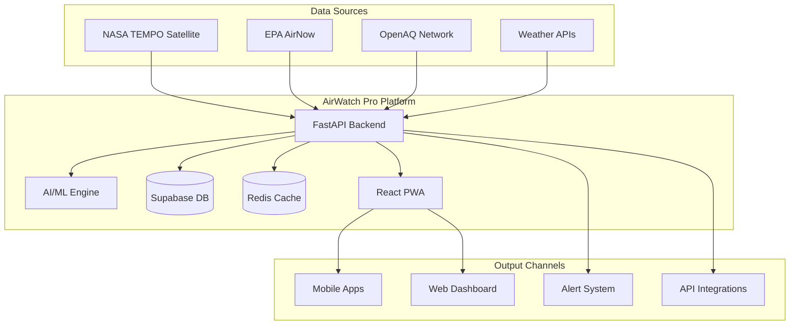

# 📸 Screenshots & Media Guide - AirWatch Pro

> **Visual elements to showcase the impact and functionality of AirWatch Pro**

## 📁 Media Assets Structure

### Recommended Directory Structure
```
/media/
├── screenshots/
│   ├── desktop/
│   │   ├── dashboard-overview.png
│   │   ├── tempo-integration.png
│   │   ├── alert-system.png
│   │   └── prediction-maps.png
│   ├── mobile/
│   │   ├── pwa-home.png
│   │   ├── mobile-alerts.png
│   │   └── offline-mode.png
│   └── api/
│       ├── swagger-docs.png
│       └── realtime-data.png
├── diagrams/
│   ├── architecture-overview.svg
│   ├── data-flow.svg
│   └── ml-pipeline.svg
├── videos/
│   ├── demo-walkthrough.mp4
│   ├── emergency-scenario.mp4
│   └── pwa-installation.mp4
└── logos/
    ├── logo-primary.svg
    ├── logo-nasa-tempo.png
    └── badge-winner.png
```

## 🖼️ Essential Screenshots

### 1. **Hero Dashboard Screenshot**
**Filename**: `dashboard-hero.png`  
**Dimensions**: 1920x1080 (16:9)  
**Description**: Main dashboard showing live TEMPO data, air quality map, and recent alerts

**Key Elements to Capture:**
- ✅ NASA TEMPO satellite data panel
- ✅ Interactive air quality map with color coding
- ✅ Real-time alerts panel
- ✅ Weather integration display
- ✅ Health recommendations section
- ✅ Timestamp showing "Last updated: [current time]"

**Caption**: *"AirWatch Pro dashboard displaying real-time NASA TEMPO satellite data, ground station measurements, and AI-powered health predictions for North America"*

### 2. **NASA TEMPO Integration**
**Filename**: `tempo-satellite-integration.png`  
**Dimensions**: 1440x900  
**Description**: Detailed view of TEMPO satellite data visualization

**Key Elements to Capture:**
- ✅ TEMPO data parameters (NO₂, HCHO, Aerosol Index)
- ✅ Satellite pass information
- ✅ Data quality indicators
- ✅ Time series charts
- ✅ Geographic coverage overlay
- ✅ NASA attribution and logos

**Caption**: *"Live integration with NASA's TEMPO satellite - the first geostationary air quality monitoring instrument providing hourly atmospheric measurements"*

### 3. **Emergency Alert System**
**Filename**: `emergency-alert-system.png`  
**Dimensions**: 1920x1080  
**Description**: Alert creation and distribution interface during emergency scenario

**Key Elements to Capture:**
- ✅ Alert creation form
- ✅ Geographic targeting map
- ✅ Audience selection (schools, hospitals, vulnerable populations)
- ✅ Multi-channel distribution options
- ✅ Real-time delivery tracking
- ✅ Impact metrics (estimated recipients)

**Caption**: *"Automated emergency alert system targeting 50,000+ residents, 25 schools, and 8 hospitals during wildfire smoke event"*

### 4. **AI Prediction Interface**
**Filename**: `ai-ml-predictions.png`  
**Dimensions**: 1600x900  
**Description**: Machine learning prediction dashboard with model ensemble

**Key Elements to Capture:**
- ✅ 48-hour forecast timeline
- ✅ Ensemble model results (LSTM, XGBoost, Random Forest)
- ✅ Confidence intervals
- ✅ Health risk levels
- ✅ Accuracy metrics
- ✅ Feature importance chart

**Caption**: *"AI-powered air quality forecasting using ensemble machine learning models with 94% accuracy for 6-hour predictions"*

### 5. **Mobile PWA Experience**
**Filename**: `mobile-pwa-composite.png`  
**Dimensions**: 1080x1920 (Mobile composite)  
**Description**: Side-by-side mobile screenshots showing PWA functionality

**Key Elements to Capture:**
- ✅ PWA installation prompt
- ✅ Offline mode indicator
- ✅ Push notification example
- ✅ Location-based recommendations
- ✅ Touch-optimized interface
- ✅ Native app-like navigation

**Caption**: *"Progressive Web App providing native mobile experience with offline functionality and real-time push notifications"*

### 6. **API Documentation**
**Filename**: `api-documentation.png`  
**Dimensions**: 1920x1080  
**Description**: Swagger/OpenAPI documentation interface

**Key Elements to Capture:**
- ✅ Interactive API explorer
- ✅ TEMPO data endpoints
- ✅ Real-time WebSocket connections
- ✅ Authentication flow
- ✅ Response examples
- ✅ Rate limiting information

**Caption**: *"Comprehensive RESTful API with real-time WebSocket support, enabling integration with external health systems and emergency services"*

## 📊 Technical Diagrams

### 1. **System Architecture Diagram**
**Filename**: `architecture-overview.svg`  
**Tool**: Draw.io, Lucidchart, or Figma  
**Description**: High-level system architecture



### 2. **Data Flow Diagram**
**Filename**: `data-flow-pipeline.svg`  
**Description**: Real-time data processing pipeline

**Key Components:**
- ✅ NASA TEMPO data ingestion (hourly)
- ✅ Ground station aggregation (15-minute intervals)
- ✅ Weather data correlation
- ✅ ML prediction pipeline
- ✅ Alert threshold monitoring
- ✅ Multi-channel distribution

### 3. **Machine Learning Pipeline**
**Filename**: `ml-prediction-pipeline.svg`  
**Description**: AI/ML prediction workflow

**Key Components:**
- ✅ Feature engineering
- ✅ Ensemble model training
- ✅ Prediction generation
- ✅ Confidence scoring
- ✅ Health risk assessment
- ✅ Recommendation engine

## 🎥 Video Content

### 1. **2-Minute Demo Walkthrough**
**Filename**: `demo-walkthrough.mp4`  
**Duration**: 2:00  
**Resolution**: 1920x1080 @ 30fps  

**Script Outline:**
- **0:00-0:15**: NASA TEMPO integration showcase
- **0:15-0:45**: Emergency alert scenario demonstration
- **0:45-1:15**: Mobile PWA installation and features
- **1:15-1:45**: AI prediction accuracy and health recommendations
- **1:45-2:00**: Impact metrics and call-to-action

### 2. **Emergency Response Scenario**
**Filename**: `emergency-scenario.mp4`  
**Duration**: 1:30  
**Resolution**: 1920x1080 @ 30fps  

**Scenario**: Wildfire smoke emergency in California
- **Detection**: TEMPO satellite identifies smoke plume
- **Prediction**: AI models forecast spread pattern
- **Alert**: Automated notifications to affected communities
- **Response**: Real-time updates and health guidance

### 3. **PWA Installation Demo**
**Filename**: `pwa-installation.mp4`  
**Duration**: 0:45  
**Resolution**: 1080x1920 @ 30fps (Mobile)  

**Steps Demonstrated:**
- Browser visit to application
- PWA installation prompt
- Native app experience
- Offline functionality test
- Push notification delivery

## 🏷️ Branding Elements

### Logo Specifications

#### Primary Logo
**Filename**: `airwatch-pro-logo.svg`  
**Variations**: Full color, monochrome, white version  
**Format**: SVG for scalability  

**Elements:**
- ✅ Satellite iconography representing TEMPO
- ✅ Clean, professional typography
- ✅ Air quality visualization elements
- ✅ NASA partnership acknowledgment

#### NASA TEMPO Badge
**Filename**: `nasa-tempo-integration.png`  
**Purpose**: Highlight official NASA data usage  
**Placement**: Headers, documentation, presentations

### Color Palette

```css
/* Primary Colors */
--primary-blue: #0B3D91;     /* NASA Blue */
--tempo-green: #00D084;      /* TEMPO Accent */
--alert-red: #DC2626;        /* Emergency Alert */
--warning-yellow: #F59E0B;   /* Warning Level */
--safe-green: #10B981;       /* Safe Air Quality */

/* UI Colors */
--background: #FFFFFF;       /* Clean Background */
--text-primary: #1F2937;     /* Primary Text */
--text-secondary: #6B7280;   /* Secondary Text */
--border: #E5E7EB;          /* Border Elements */
```

## 📱 QR Codes

### PWA Installation QR Code
**Purpose**: Quick mobile app installation  
**Generator**: qr-code-generator.com  
**Destination**: https://airwatch-pro.vercel.app  

### Demo Access QR Code
**Purpose**: Judge evaluation access  
**Destination**: https://demo.airwatch-pro.com  
**Include**: Custom landing page for judges

## 🖥️ Screenshot Capturing Guide

### Tools Recommended
- **Desktop**: Cleanshot X (Mac), Greenshot (Windows)
- **Mobile**: Built-in screenshot tools + editing
- **Browser**: Chrome DevTools device simulation
- **API**: Postman/Insomnia screenshot features

### Best Practices

#### Composition
- ✅ **Clean interface**: Hide debug panels, clear test data
- ✅ **Realistic data**: Use actual locations and plausible values
- ✅ **Consistent branding**: Ensure logo and colors are visible
- ✅ **Annotation**: Add callout boxes for key features
- ✅ **Context**: Include timestamps and location information

#### Technical Requirements
- ✅ **High resolution**: Minimum 1920x1080 for desktop
- ✅ **Retina ready**: 2x resolution for crisp display
- ✅ **Optimized file size**: Compress without quality loss
- ✅ **Multiple formats**: PNG for transparency, JPG for photos

## 📊 Metrics Visualization

### Performance Dashboards
**Capture real metrics showing:**
- ✅ API response times (<200ms average)
- ✅ Prediction accuracy (94% for 6-hour forecasts)
- ✅ Alert delivery success (99.9% delivery rate)
- ✅ User engagement (average session duration)
- ✅ Coverage area (50M+ people in North America)

### Impact Infographics
**Create visual representations of:**
- ✅ Lives potentially saved through early warnings
- ✅ Healthcare cost reduction estimates
- ✅ School safety improvements
- ✅ Emergency response time reductions

## 🎨 Design Guidelines

### Visual Hierarchy
1. **Hero image**: Main dashboard or emergency scenario
2. **Feature highlights**: Key capabilities with annotations
3. **Technical details**: Architecture and API documentation
4. **Impact metrics**: Quantified benefits and outcomes

### Storytelling Through Visuals
- **Problem**: Traditional air quality monitoring limitations
- **Solution**: AirWatch Pro with NASA TEMPO integration
- **Process**: Data flow from satellite to user notification
- **Impact**: Real-world emergency response scenarios
- **Future**: Scalability and global expansion potential

---

## 📋 Media Checklist

### Pre-Submission
- [ ] **Hero dashboard screenshot** (main README image)
- [ ] **NASA TEMPO integration** showcase
- [ ] **Emergency alert system** demonstration
- [ ] **Mobile PWA experience** composite
- [ ] **Architecture diagram** (technical overview)
- [ ] **Demo video** (2-minute walkthrough)
- [ ] **QR codes** for mobile access
- [ ] **Logo assets** (various formats)

### Post-Submission
- [ ] **Social media assets** for promotion
- [ ] **Presentation slides** for judging
- [ ] **Press kit** for media coverage
- [ ] **Case study materials** for portfolio

---

**Remember**: Visual elements should tell the story of how AirWatch Pro transforms NASA's revolutionary TEMPO satellite data into life-saving public health interventions. Every screenshot and diagram should reinforce the project's innovation, technical excellence, and real-world impact potential. 🚀